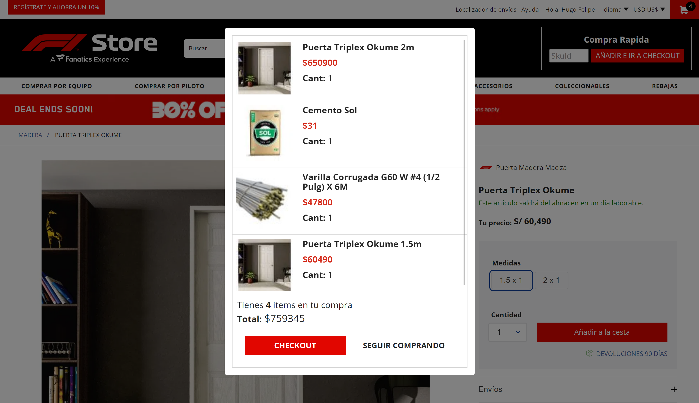

# Add To Cart Information

<!-- DOCS-IGNORE:start -->
<!-- ALL-CONTRIBUTORS-BADGE:START - Do not remove or modify this section -->
[](#contributors-)
<!-- ALL-CONTRIBUTORS-BADGE:END -->
<!-- DOCS-IGNORE:end -->

The Add To Cart Information component displays a summary of the current order and is updated when the customer add a new item to the cart. The summary contains information about the products in the cart, total of items and the total price; with two optional buttons: one to go to the checkout and other to continue shopping. It can be declare where it is needed.


 


## Configuration 

### Step 1 - Adding the Add To Cart Information app to your theme's dependencies

In your theme's `manifest.json`, add the Add To Cart Info app as a dependency:

```json
  "dependencies": {
    "vendor.add-to-cart-info": "0.x"
  }
```

### Step 2 - Declaring the block on the page you want it to be displayed

Now, you can use the block exported by the `add-to-cart-info` app.

#### `add-to-cart-info` blocks
 Block name   | Description  |
| -------- | ------------------------ | 
| `add-to-cart-info`     |   renders a table with a summary of the items added to the cart, the total number of items and the total price of the current order. For another part, two optional buttons: one to redirect the customer to the checkout and other to keep shopping(mainly use when the component is declared in modals).                   

```json
  "store.home": {
    "blocks": [
        "responsive-layout.desktop"
    ]
  },
  "responsive-layout.desktop": {
    "children": [
        "add-to-cart-info"
    ]
  }
```

### Step 2 - Defining the props that the component will have

Check all props to configure the block in the table below:

### `add-to-cart-info` props

| Prop name    | Type            | Description    | Default value                                                                                                                               |
| ------------ | --------------- | --------------------------------------------------------------------------------------------------------------------------------------------- | ---------- | 
| `diplayCheckoutButton`      | `boolean`       | The diplayCheckoutButton parameter renders a button that redirect the customer to the checkout when its value is 'true' | `false`        |
| `diplayShoppingButton`      | `boolean`       | The diplayShoppingButton parameter renders a button that scroll the page to the top when its value is 'true'. This prop is highly recommended to be use when the `add-to-cart-info` block is declared in a modal layout  | `false`        |

## Customization

In order to apply CSS customizations in this and other blocks, follow the instructions given in the recipe on [Using CSS Handles for store customization](https://vtex.io/docs/recipes/style/using-css-handles-for-store-customization).

| CSS Handles |
| ----------- | 
| `add-to-cart-info__general--container` | 
| `totalizers__container` | 
| `totalizers__quantity` | 
| `productGroup__general--container` | 
| `productGroup__container` | 
| `productGroup__image--container` |
| `productGroup__image` |
| `productGroup__info--container` |
| `productGroup__info--name` |
| `productGroup__info--price` |
| `productGroup__info--quantity` |
| `order__buttons--container` |
| `order__checkout--container` |
| `order__checkout--button` |
| `order__shopping--container` |
| `order__shopping--button` |

<!-- DOCS-IGNORE:start -->

## Contributors ✨

1. Hugo Felipe Riveros Fajardo

---- 

Check out some documentation models that are already live: 
- [Breadcrumb](https://github.com/vtex-apps/breadcrumb)
- [Image](https://vtex.io/docs/components/general/vtex.store-components/image)
- [Condition Layout](https://vtex.io/docs/components/all/vtex.condition-layout@1.1.6/)
- [Add To Cart Button](https://vtex.io/docs/components/content-blocks/vtex.add-to-cart-button@0.9.0/)
- [Store Form](https://vtex.io/docs/components/all/vtex.store-form@0.3.4/)
